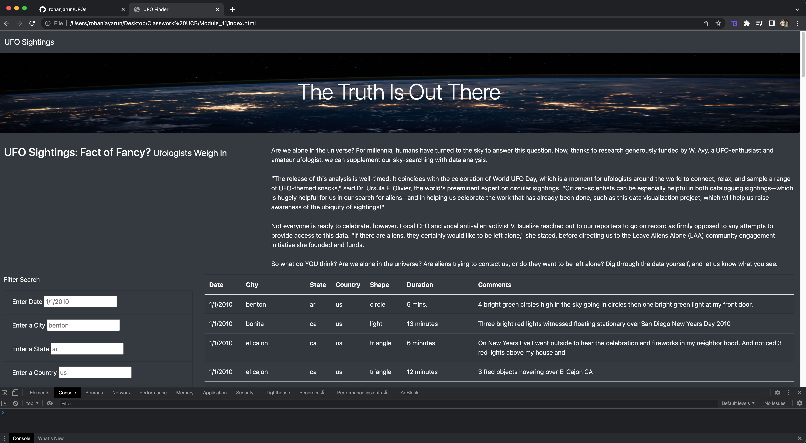
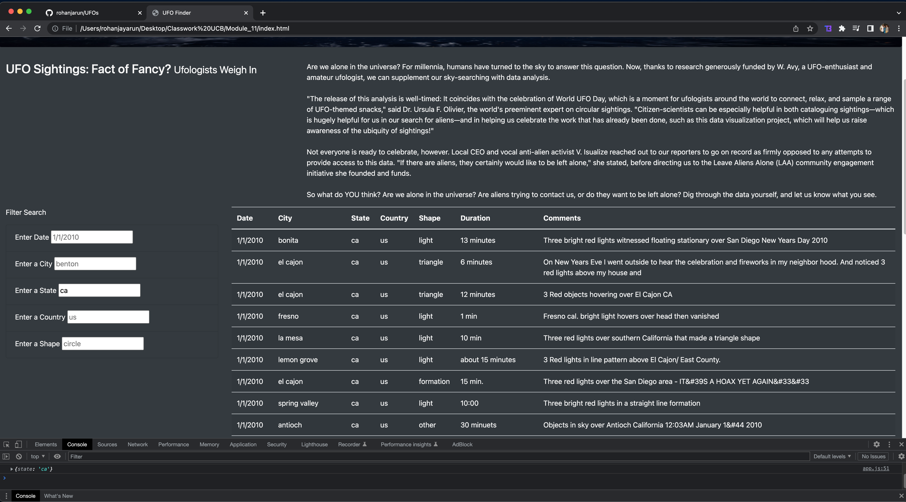

# UFOs
## Purpose
Provide a more in-depth analysis of UFO sightings by allowing users to filter for multiple criteria at the same time. In addition to the date, you’ll add table filters for the city, state, country, and shape.

## Result
Here we can see that the more fields have been added so that we can get a clear search based on user input which makes it more accessible and friendlier to the user. 

Here is a better gage of what we can see with regards to UFO sightings in California. 

## Summary
A minor setback is the size of the dataset, which seems to be very small. Along with case sensitivity, if these 2 issues are adressed then we would be able to get a better result. We could improve this by also providing a drop down of options for users so they know the parameters. 
